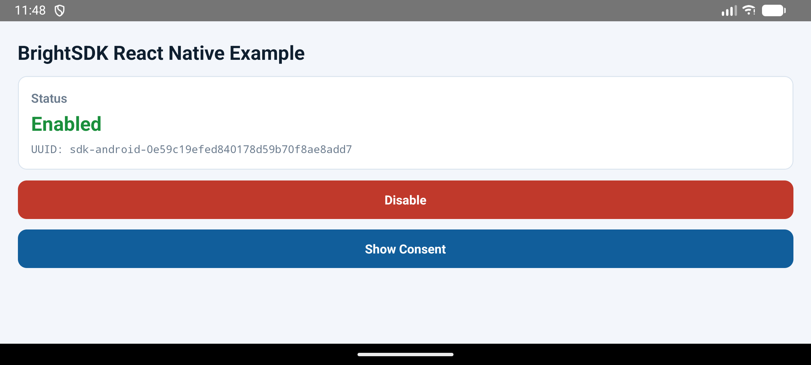
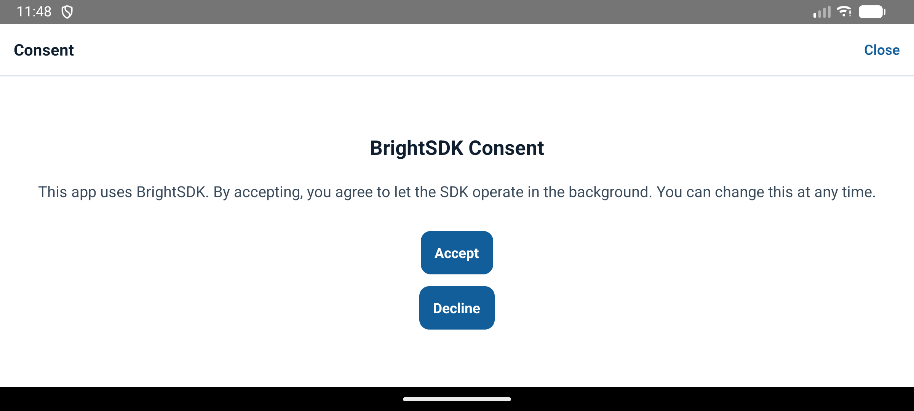
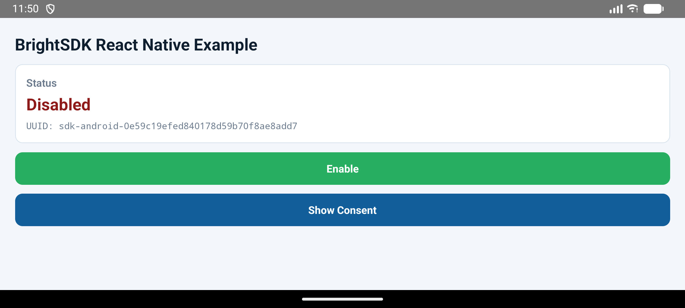

# BrightSDK React Native Example App

Minimal React Native app demonstrating `react-native-bright-sdk` integration.

## Screenshots

### Android

| SDK Enabled | Consent Screen | SDK Disabled |
|:-----------:|:--------------:|:------------:|
|  |  |  |

### Windows

_Coming soon_

## Prerequisites

- Node.js >= 18
- React Native CLI (`@react-native-community/cli`)
- **Android:** Android SDK, JDK 17+, Gradle 8.1+
- **Windows:** Visual Studio 2022, Windows 10 SDK (10.0.17763.0+), React Native Windows

## Quick Start

### 1. Scaffold the example project

From the repository root:

```bash
bash ./example/scaffold.sh
```

This generates the `example/react-native-app/` directory with native platform projects and configuration files.

### 2. Install dependencies

```bash
npm --prefix ./example/react-native-app install
```

### 3. Run

**Android:**

```bash
npm --prefix ./example/react-native-app run android
```

**Windows:**

```bash
npm --prefix ./example/react-native-app run windows
```

**Start Metro bundler only:**

```bash
npm --prefix ./example/react-native-app start
```

## Windows: BrightSDK binaries

The Windows native module dynamically loads `lum_sdk.dll` at runtime. Place the SDK binaries in `example/brightsdk/` before building:

```
example/brightsdk/
  lum_sdk.dll        # required — must match the target architecture (x86/x64/ARM64)
  brd_config.json    # optional — SDK configuration
```

The MSBuild project copies these files into the app package automatically. Without `lum_sdk.dll`, the app still runs but all SDK calls are no-ops.

## Scaffold options

```
bash ./example/scaffold.sh [options]

  --skip-install   Skip npm install during React Native init
  --clean-native   Remove existing android/ios and config files before copy
  --clean-all      Remove all generated example artifacts and exit
```

## Project structure

```
example/
  scaffold.sh              # generates and updates the example app
  brightsdk/               # SDK runtime binaries (gitignored)
  react-native-app/
    src/App.js              # main app component
    index.js                # entry point
    package.json            # depends on react-native-bright-sdk via file:../..
    metro.config.js         # configured to resolve the local plugin
    react-native.config.js  # autolinking overrides
    android/                # Android native project
    windows/                # Windows native project
```
